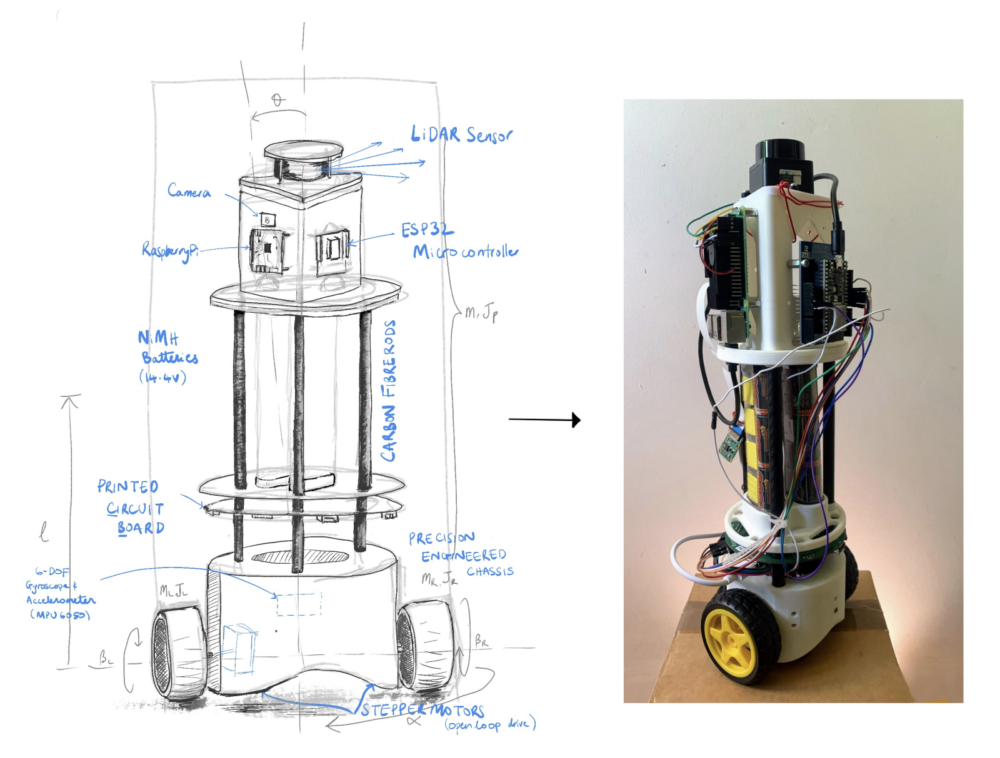
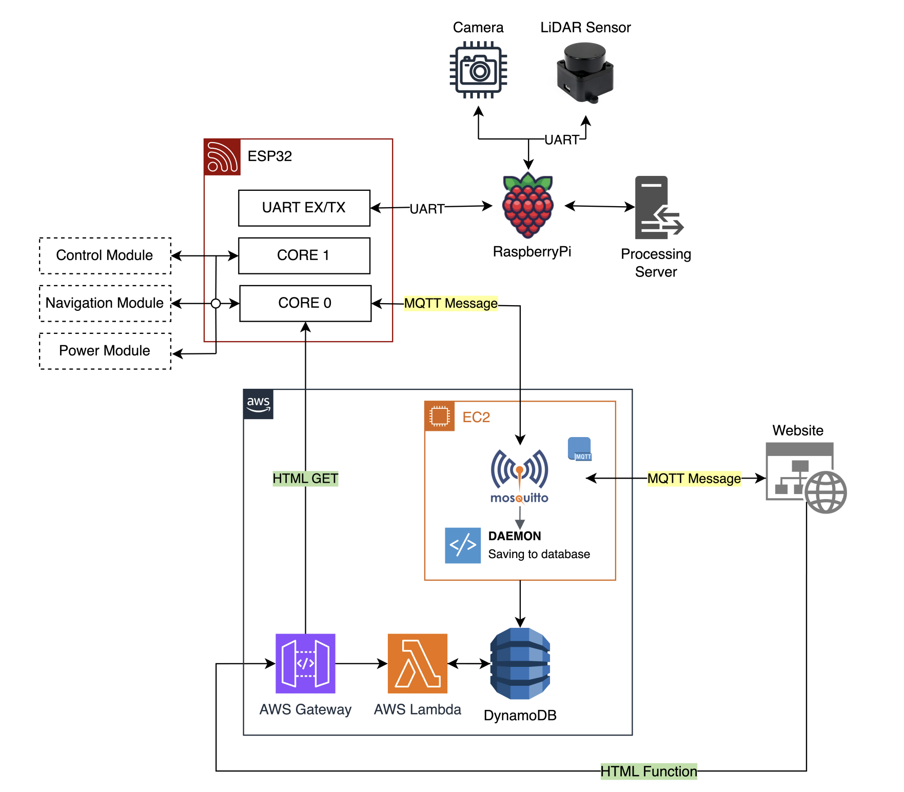

# TED

This repository contains the codebase we developped as part of a end of year project at Imperial College London.

This was a group project conducted by [Veer Tandon](https://www.linkedin.com/in/veer-tandon-b882381a9/), [Varun Sangtani](https://www.linkedin.com/in/varun-sangtani/), [Kevin Lau](https://www.linkedin.com/in/kevinlau01/), [Sanjit Raman](https://www.linkedin.com/in/sanjitraman/), [William Huynh](https://www.linkedin.com/in/wh691/) and [Sara Chehab](https://www.linkedin.com/in/sarachehab/).

We were tasked with developping an autonomous robot doubling as IoT device.
An elaborate SLAM algorithm was implemented to allow for field mapping and recognition.

The Tactical Environment Detector (TED) is a self-balancing two-wheeled robot capable of discovering and reporting incidents that have occured within a warehouse.



To augment your experience, we have attached two videos:
* A short run of TED from Kevin's kitchen, available [here](https://youtu.be/uRm12rrl6rE).
* A live recording of the professor's demonstration, available [here](https://youtu.be/qnesSsMQPao).

## Development Lifecycle

The high-level diagram of the bot, with modes of transmission, is shown in the diagram below.



For more details, please consult the report, available [here](https://github.com/TorturedEngineersDept/BalanceBot/blob/main/TOD-report.pdf).

## Flashing the ESP32

Follow instructions on [the PlatformIO website](https://platformio.org/install/cli)
to download PlatformIO CLI.

Then run these following commands:

```bash
cd esp32
./run.sh
```

## Starting the website

To run the website on `localhost:3000`, run the following commands:

```bash
cd server/website
npm i
npm start
```

## Raspberry Pi setup

See the docs in the [`pi`](pi) folder.